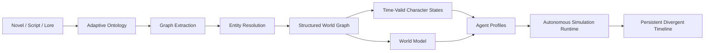
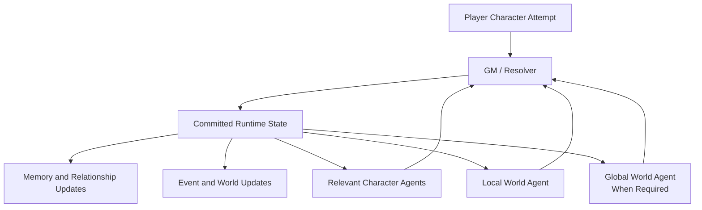

# Story2World

**Turn long-form narratives into persistent worlds populated by autonomous agents.**

Story2World is a local-first AI framework that reconstructs novels, scripts, lore documents, and other long-form narratives as structured, simulation-ready worlds.

It does not stop at summarization, question answering, or character prompting. It builds persistent identities, time-valid character states, relationships, abilities, items, knowledge boundaries, world rules, event dependencies, autonomous agents, and a mutable runtime in which the original story can genuinely diverge.


---

## Quick Start

### 1. Install dependencies

```bat
01_install_requirements.bat
```

### 2. Prepare a novel

```bat
02_prepare_simulation.bat
```

In the preparation UI:

1. Select a TXT novel or narrative source.
2. Choose how much of the source to process.
3. Select the story point from which the simulation should begin.
4. Connect an OpenAI-compatible LLM.
5. Generate the world, character, agent, and runtime data.

The source preview can be used to inspect the selected story position before generation.

### 3. Start the simulation

```bat
03_run_simulation.bat
```

Choose a character, inspect the reconstructed starting state, and enter the world as that character.

The player controls only that character's attempted actions. Other characters and the world remain independently controlled.

### LLM Configuration

Story2World supports OpenAI-compatible APIs, including local inference through LM Studio.

Example `settings.json`:

```json
{
  "llm_base_url": "http://localhost:1234/v1",
  "llm_model": "gemma-4-26b-a4b-it",
  "llm_api_key": "lm-studio"
}
```

Environment variables can override the saved profile:

```text
NOVEL_LLM_BASE_URL
NOVEL_LLM_MODEL
NOVEL_LLM_API_KEY
```

For a limited command-line pipeline test:

```bat
python pipeline_program.py --novel "C:\path\to\novel.txt" --percent 100 --chunk-limit 20
```

Use `--chunk-limit 0` to process all chunks in the selected source range.

---

## What Story2World Is

Most AI narrative systems operate on text.

Story2World operates on a world.

A typical roleplay system receives a character prompt, the recent conversation, and a user message. The model then writes the next reply. This can produce convincing dialogue, but it does not create a persistent world with reliable identity, causality, ownership, memory, knowledge boundaries, or independent actors.

Story2World reconstructs those missing layers.



The result is not a collection of generated JSON files for their own sake.

The result is a world in which:

- the same person remains the same person across hundreds of chapters,
- characters know only what they should know,
- NPCs are not controlled by the player,
- the world can initiate events without waiting for user instructions,
- relationships, ownership, abilities, goals, and memories can change,
- canonical events can fail when their prerequisites no longer exist,
- and the simulation can be saved, restored, and continued as a changing world rather than as a long chat transcript.


---

## The Problems Story2World Already Solves

## 1. Persistent Identity Across an Entire Narrative

Long stories rarely refer to an entity by one stable name.

A character may appear through:

- a birth name,
- a title,
- a nickname,
- a disguise,
- a transformed body,
- a temporary identity,
- a role-based form of address,
- or a description that only makes sense through surrounding events.

Naive alias matching fails in both directions. It may split one character into several entities or merge different characters because their names look similar.

Story2World performs graph-based entity resolution. Identity is evaluated through connected narrative structure, including shared relationships, abilities, items, locations, events, explicit aliases, titles, transformations, and identity statements.

This means a character can change name, title, form, or apparent role without losing its persistent identity, memories, relationships, or runtime state.

This is not a cosmetic cleanup step. Without stable identity, every downstream component becomes unreliable:

- memories attach to the wrong agent,
- relationships fragment,
- abilities duplicate,
- ownership becomes inconsistent,
- event histories split,
- and roleplay drifts between incompatible versions of the same person.

Story2World solves identity before asking agents to act.

---

## 2. Simulation-Ready World Reconstruction Instead of Generic Summarization

Story2World does not extract information merely because it can be found.

Every structured field must answer a downstream question:

- Which agent uses it?
- Which runtime decision depends on it?
- Which rule does it validate?
- Which retrieval query does it support?
- Which state transition can modify it?

The pipeline reconstructs the parts of a world that matter for simulation:

- characters and identities,
- locations and spatial context,
- organizations and authority,
- relationships and relationship history,
- abilities and their conditions,
- items, ownership, use, loss, and transfer,
- events, prerequisites, causes, and consequences,
- titles, disguises, and transformations,
- knowledge ownership and information boundaries,
- world rules and constraints,
- goals, conflicts, and temporal progression.

The framework therefore produces an operational world model, not a decorative lore summary.

---

## 3. A Story Can Begin at the Correct Historical State

A common failure in AI adaptations is temporal leakage.

A simulation may begin halfway through a novel, but characters still receive abilities, relationships, identities, items, or knowledge acquired near the ending.

Story2World reconstructs the world at a selected canonical cutoff.

At the chosen starting point, each character receives only what is valid at that time:

- current identity,
- known relationships,
- acquired abilities,
- current items and ownership,
- organization membership,
- existing memories,
- known information,
- current location,
- active conflicts,
- and relevant goals.

Future developments remain unavailable until they are reached or independently caused in the new timeline.

A character cannot use an ability it has not learned, remember an event that has not happened, or treat a future relationship as current truth.

---

## 4. Canon Is History; Runtime Is Current Reality

Story2World separates the original narrative from the live simulation.

**Canonical state** describes the source timeline.

**Runtime state** describes what is true now.

This distinction prevents one of the most persistent failures in branching narrative systems: canonical snapback.

Without a strict separation, an LLM repeatedly reintroduces original events even after the simulation has invalidated them. Dead characters return, lost items reappear, future abilities arrive early, changed relationships reset, and major plot points occur simply because they existed in the source.

Story2World treats canonical events as historical context, likely pressure, and default causal routes—not as commands that must execute.

If runtime actions destroy an event's prerequisites, that event can be blocked, delayed, transformed, reassigned, or replaced by a new consequence.

The branch is therefore stored in world state, not merely described in prose.

---

## 5. The Player Controls One Participant, Not the Entire World

In many roleplay systems, the user effectively controls every actor because the model tries to satisfy the latest instruction.

Story2World treats player input as one character's attempted action.

The player does not directly decide:

- whether the action succeeds,
- how another character feels,
- whether an NPC cooperates,
- what the environment does,
- how the world interprets the attempt,
- or which consequences become real.

Other characters remain autonomous participants.

They can:

- refuse,
- lie,
- negotiate,
- retreat,
- attack,
- conceal information,
- protect their own interests,
- change plans,
- exploit opportunities,
- or leave the player behind.

The user enters the world. The world does not become the user's puppet.

---

## 6. NPCs Have Agency Beyond Replying to the User

A character agent is not just a speaking style.

Each active character is grounded in:

- persistent identity,
- current physical and emotional state,
- visible environment,
- memories,
- known information,
- relationships,
- abilities and limitations,
- possessions,
- current goals,
- longer-term motivations,
- behavioral constraints,
- and source-grounded retrieval.

This gives the model reasons to produce character-specific decisions rather than character-flavored dialogue.

A static prompt can say that a character is loyal.

A persistent agent state can represent:

- who the character is loyal to,
- what could break that loyalty,
- what promises have been made,
- what betrayal the character remembers,
- what information is still hidden,
- and what competing goal may override the relationship.

Story2World strengthens roleplay by strengthening the conditions under which decisions are made.

---

## 7. The World Can Move Without Waiting for the Player

Many AI simulations are entirely reactive. If the user does not invent the next event, nothing changes.

Story2World gives the local world responsibility for maintaining and advancing the immediate environment.

The world can introduce plausible developments such as:

- character movement,
- environmental changes,
- interruptions,
- witnesses,
- opportunities,
- hazards,
- discoveries,
- escalating conflicts,
- consequences from earlier events,
- and new local pressures.

This allows scenes to develop even when the player is passive.

The simulation is not only a response generator. It has its own momentum.

---

## 8. Selective Agent Activation Keeps Autonomy Scalable

More agents do not automatically create a better simulation.

Running every character on every turn wastes computation, increases contradictory outputs, and makes orchestration harder.

Story2World uses selective activation. Agents can become active or remain dormant according to scene relevance and causal impact, including:

- physical presence,
- event involvement,
- important relationships,
- active goals,
- possession of relevant information,
- travel,
- time progression,
- or high-impact world changes.

A minor character can still act independently when relevant, but does not consume a full reasoning pass when nothing affects it.

This preserves autonomy without confusing agent count with simulation quality.

---

## 9. Character Knowledge Is Bounded

A believable character should not know the entire source.

Story2World builds actor-facing retrieval around the character's own perspective:

- what the character has witnessed,
- what the character has been told,
- what the character currently remembers,
- what is visible in the scene,
- what is valid at the current point in time,
- and what is relevant to the present decision.

Future canonical anchors and author-level knowledge can support system consistency without being exposed directly to the acting character.

This prevents accidental prophecy, omniscient dialogue, and decisions based on information the character could not possess.

It also allows two characters to understand the same event differently.

Objective runtime truth and subjective character knowledge are not treated as the same thing.

---

## 10. Relationships Are Dynamic State, Not Final Labels

Relationships are not reduced to a single label such as `friend`, `enemy`, or `lover`.

Story2World can represent relationship dimensions that change through events:

- trust,
- fear,
- loyalty,
- hostility,
- dependence,
- authority,
- obligation,
- familiarity,
- suspicion,
- debt,
- unresolved conflict,
- and cooperation.

Canonical relationships provide historical context.

Runtime relationships reflect what has actually happened in the current simulation.

A friendship can weaken. An enemy can become useful. A subordinate can rebel. A stranger can become trusted. A promise can create an obligation. Repeated betrayal can become a persistent belief.

The relationship system is connected to events and memory rather than frozen at the source ending.

---

## 11. Abilities, Items, Identities, and Organizations Have Histories

Story2World does not assume that a resource permanently belongs to its final canonical owner.

Abilities, items, identities, and organizational roles can carry conditions for:

- acquisition,
- use,
- upgrade,
- loss,
- transfer,
- release,
- replacement,
- and restriction.

This allows the runtime to answer questions that ordinary character cards cannot:

- Does the character possess this item now?
- Has the ability already been learned?
- Can the ability be used under current conditions?
- Was ownership transferred?
- Has an identity been abandoned?
- Does the organization still recognize this member?
- Did a divergent event block the original acquisition path?

These are state questions, not prose questions.

---

## 12. Multi-Agent Responsibilities Are Separated

Story2World does not ask one model to simultaneously:

- roleplay every character,
- narrate the scene,
- invent world events,
- judge success,
- enforce rules,
- remember history,
- update relationships,
- and save the world state.

The runtime separates responsibilities.



- **Character Agents** decide from their own perspectives.
- **The Local World Agent** maintains the current area's sensory state, positions, local events, and environmental pressure.
- **The Global World Agent** handles larger travel, time jumps, regional consequences, and high-impact changes.
- **The GM / Resolver** evaluates attempts, causal consistency, rules, and consequences.
- **The Runtime Store** becomes the authoritative current state after changes are committed.

This separation makes the system easier to reason about, test, extend, and correct than a single monolithic prompt.

---

## 13. The Runtime Persists a World, Not Just a Conversation

Story2World saves more than dialogue.

The live runtime maintains changing information such as:

- current character state,
- locations and nearby characters,
- active goals,
- agent memories,
- known information,
- relationship state,
- item ownership,
- equipment,
- injuries and active effects,
- event queues,
- world changes,
- recent interaction context,
- and recovery snapshots.

A saved session can reopen with the latest world state, location, active characters, recent developments, and simulation time.

The purpose is to continue the same world—not merely to continue the same chat window.

---

## 14. Source-Grounded RAG Supports Decisions, Not Only Answers

Story2World combines dense retrieval and BM25 through hybrid search.

Retrieval is used throughout the system to provide:

- source evidence for world construction,
- context for identity resolution,
- character-specific information,
- relevant relationships and events,
- nearby canonical anchors,
- world rules,
- and runtime decision context.

Different reasoning components do not need identical context.

Actor-facing packets can exclude future information. System-facing packets can use broader evidence for consistency. Per-agent retrieval sidecars keep relevant information attached to active agents without forcing the full world into every prompt.

RAG is therefore part of the simulation architecture, not a separate question-answering feature.

---

## Why This Is Difficult to Reproduce

Story2World is not a prompt collection.

It connects several hard problems that must agree with each other:

1. long-document processing,
2. adaptive ontology construction,
3. graph extraction,
4. cross-chapter entity resolution,
5. temporal state reconstruction,
6. character and world modeling,
7. hybrid retrieval,
8. knowledge-boundary control,
9. multi-agent orchestration,
10. causal adjudication,
11. mutable runtime state,
12. persistence and recovery.

A failure in an early stage propagates into every later stage.

If identity resolution fails, memories and relationships attach to the wrong person.

If temporal reconstruction fails, characters receive future knowledge and resources.

If canon and runtime are mixed, the branch collapses back into the original plot.

If agents share unrestricted context, roleplay becomes omniscient.

If world events are not committed as state, consequences disappear after a few turns.

The engineering challenge is not generating one impressive response. It is making all of these layers remain compatible over time.

---

## Story2World vs. Typical AI Roleplay

| Typical AI Roleplay | Story2World |
|---|---|
| A character is defined by a prompt | A character is reconstructed from the source and maintained as mutable state |
| The model writes the next reply | Multiple components decide what happens and commit the result |
| The user drives nearly every event | NPCs and the world can initiate actions |
| Characters often share global context | Each agent has bounded knowledge and retrieval |
| Aliases are matched mainly by text | Identity is resolved through graph structure and narrative context |
| The final source state leaks into earlier scenes | Starting state is reconstructed at a selected canonical cutoff |
| Canon facts and current facts are mixed | Canonical history and runtime truth are separated |
| Relationships are static labels | Relationships evolve through events |
| Inventory and abilities are prompt text | Ownership, acquisition, use, loss, and transfer are stateful |
| Every agent runs, or one model impersonates everyone | Relevant agents are selectively activated |
| Long-term continuity depends on chat history | Continuity is maintained through persistent world and agent state |
| Branching means different prose | Branching changes the actual runtime world |


---

## General by Design

Story2World is not a simulator handcrafted for one novel, protagonist, genre, or power system.

The source defines the world.

A fantasy story may emphasize:

- supernatural abilities,
- artifacts,
- transformations,
- factions,
- and magical constraints.

A detective story may emphasize:

- evidence,
- alibis,
- hidden knowledge,
- motives,
- locations,
- and timelines.

A political drama may emphasize:

- organizations,
- authority,
- alliances,
- secrets,
- public positions,
- and conflicting incentives.

A science-fiction setting may emphasize:

- technology,
- access rights,
- species,
- planetary locations,
- and physical rules.

Story2World first identifies which entities and relationships matter to the source, then maps them into a common simulation architecture.

The project deliberately avoids:

- novel-specific stopword lists,
- handcrafted character registries,
- title rules written for one book,
- plot keywords that force expected results,
- and one-off patches that only improve a single example.

The system should become better by improving general representation, evidence use, validation, and state management—not by hiding knowledge of the test novel inside the code.

---

## Potential Beyond Novels

The current application focuses on narrative worlds, but the architecture is more general.

Any domain that can be represented through entities, relationships, rules, events, knowledge boundaries, goals, and mutable state can potentially use the same foundation.

### Games and Interactive Worlds

Existing lore could be transformed into persistent NPCs, factions, histories, resource systems, and world state.

Characters could continue acting after scripted content ends, remember previous players, form new relationships, and react to events elsewhere.

### Film and Television Development

Writers could change one decision and observe how consequences propagate through characters, relationships, locations, and later events.

The system can support world-consistent scenario exploration rather than isolated scene rewriting.

### Historical and Educational Simulation

Historical agents can be restricted to period-appropriate knowledge and allowed to act under the incentives, institutions, and constraints of the time.

The same architecture that prevents fictional characters from seeing the future can prevent historical agents from using unavailable information.

### Training and Scenario Rehearsal

Organizations, roles, procedures, conflicting goals, information asymmetry, and evolving conditions can be modeled for:

- negotiation,
- crisis response,
- leadership,
- decision training,
- and team coordination.

Participants would interact with agents that maintain their own interests instead of agents designed only to cooperate.

### Multi-Agent Research

The persistent world can serve as an environment for studying:

- agent autonomy,
- memory,
- cooperation,
- competition,
- deception,
- social relationships,
- information asymmetry,
- selective activation,
- emergent events,
- and long-horizon consistency.

### Narrative Intelligence Infrastructure

The structured world layer can also support:

- story search,
- source-grounded question answering,
- continuity checking,
- adaptation,
- lore management,
- character analysis,
- fan-created timelines,
- game design,
- and simulation-driven content generation.

Story2World is currently a novel-world simulator, but its architecture points toward a broader world-reconstruction and multi-agent simulation platform.

---

## Design Principles

### No Extraction Without a Consumer

A field should exist because an agent, retriever, resolver, validator, or state transition uses it.

### No Source-Specific Patching

The framework should not depend on hidden rules written for the current test novel.

### Identity Before Agency

Agents cannot remain consistent unless their identities are first resolved across the source.

### State Before Prose

Important consequences must be committed as state instead of remaining implicit in generated narration.

### Runtime Over Canon

Once the simulation diverges, current runtime truth has authority over the original route.

### Bounded Knowledge

Characters act on information they could reasonably possess.

### Independent Characters

NPCs are participants with their own incentives, not extensions of the player instruction.

### Selective Computation

Independent reasoning should run where it matters, not for every entity on every turn.

### Local-First Operation

OpenAI-compatible local models are first-class execution targets.

---

## Current Project Status

The core reconstruction and autonomous simulation architecture is operational.


### Completed

- Long-form narrative ingestion and chunking
- Dense, BM25, and hybrid retrieval
- Source-adaptive ontology generation
- Graph-based entity and relation extraction
- Cross-chapter identity resolution
- Structured world graph construction
- Character state reconstruction
- World, timeline, relationship, ability, item, organization, location, rule, and knowledge modeling
- Agent Profile generation
- Starting a simulation from a selected canonical point
- Canonical and runtime state separation
- Player-controlled and autonomous characters in the same scene
- NPC-independent behavior
- Autonomous local world progression
- Selective agent activation and dormancy
- Character-specific knowledge boundaries
- Local World, Global World, and GM / Resolver separation
- Runtime event, relationship, agent, and world state updates
- Dynamic ownership, ability, identity, and relationship changes
- Canonical event blocking and divergent consequences
- Persistent save, recovery, and continuation
- Local and remote OpenAI-compatible LLM profiles

---

## Current Work and Future Direction

The project has already moved beyond the question of whether agents and the world can act independently.

The current engineering focus is **long-running simulation stability**:

- converting dialogue and events into compact structured state changes,
- preventing raw conversation and temporary information from growing forever,
- separating immediate context, short-term memory, long-term memory, world facts, and historical archives,
- consolidating repeated memories,
- adding persistent multi-step plans for agents,
- assembling bounded decision context instead of loading the entire runtime,
- compacting and garbage-collecting obsolete state,
- creating snapshots and searchable historical archives,
- and testing consistency across hundreds or thousands of turns.

After long-horizon state management is stable, later work will focus on multi-region simulation, larger populations, lower-cost background progression, parallel execution, and a more extensible simulation platform.

---

## Vision

Story2World asks a different question from conventional AI storytelling systems.

Not:

> What should the model write next?

But:

> Given who exists, what each participant knows, what each participant wants, what has already changed, and how this world works—what happens next?

The objective is not to reproduce the source forever.

The objective is to reconstruct a world accurately enough that it can survive divergence, preserve consequences, and continue producing new history through the decisions of its inhabitants.

**Build the world from the story. Then let the world become more than the story.**
